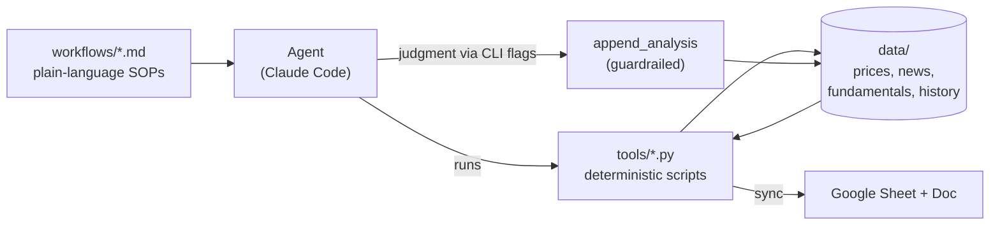
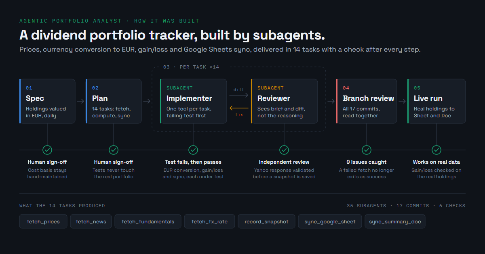

# Agentic Portfolio Analyst

An LLM agent that keeps a long-term dividend portfolio up to date: it fetches
market data, scores every holding against a written investment strategy,
writes a reasoned verdict per holding, and publishes everything to Google
Sheets and Google Docs.

The key design decision: **the language model never does arithmetic.** Every
number (prices, currency conversion, gains, scores, technical indicators,
rankings) comes from deterministic, tested Python. The agent only does what
code can't: reading the week's headlines, weighing the case for and against,
and committing to a verdict, all under rules that code enforces.

> Personal project. This is analysis tooling, not investment advice.

---

## What it produces

**A Google Sheet** with:
- an **Overview** tab: value, gain/loss, day/week/month change, four
  scores, technical signals and the agent's verdict per holding;
- one **tab per ticker** with a year of daily prices, RSI(14),
  MACD(12,26,9) and Konkorde, plus four native charts;
- **Allocation**: sector, country and position weights, with
  concentration flags (above 10% in one stock or 25% in one sector);
- **Analyst**: every holding ranked by where a new contribution looks
  best placed.

**A Google Doc** with the same picture in prose: allocation, an *Analyst
View* per holding (verdict, confidence, case for, case against, and what
would change the agent's mind) and a *Where Your Next Euro Goes* ranking.

## Architecture: Workflows, Agents, Tools



| Layer | Lives in | Responsibility |
|---|---|---|
| **Workflows** | `workflows/` | Markdown SOPs: objective, steps, which tools to run, edge cases. They also record lessons from real runs (API quirks, data gaps), so the next run doesn't repeat a mistake. |
| **Agent** | the LLM session | Reads the workflow, runs tools in order, handles failures, and writes the judgment: narrative, news sentiment, verdict, confidence. |
| **Tools** | `tools/` | Python scripts that fetch, compute, store and sync. Consistent, fast, unit-tested. |

Why this split: if each step an LLM performs directly is 90% reliable, five
chained steps succeed only 59% of the time. Moving execution into scripts
leaves the model with the one job it is good at: judgment.

### Guardrails the code enforces on the agent

- **Verdicts come from a fixed set:** `Add`, `Hold`, `Stop adding`, `Insufficient data`.
  There is no "sell"; the strategy is buy-and-hold.
- **Every verdict is recorded next to the score's own verdict**
  (`--computed-verdict`). The agent may disagree with the score, but
  `append_analysis` refuses an override without a written reason. Both are
  stored, so past overrides can be checked against what happened next.
- **Missing data stays missing:** an unavailable input is excluded
  from a score, never treated as zero. A holding that pays no dividend
  shows dividend safety as `n/a`, not 100.

## The scoring engine

`tools/analyst.py` computes four sub-scores (0–100) per holding from
fetched fundamentals and current allocation:

| Sub-score | Weight | Built from |
|---|---|---|
| Dividend safety | 0.30 | payout ratio, how well free cash flow covers the dividend |
| Quality | 0.30 | profit and operating margins, revenue and earnings growth, debt/equity, current ratio |
| Valuation | 0.25 | P/E, forward P/E, price/book, price vs analyst target, yield vs its 5-year average |
| Portfolio fit | 0.15 | current position and sector weight |

Weights are renormalized over whichever components exist. The weighted
*add score* maps to a verdict (≥ 65 Add, ≥ 45 Hold, else Stop adding) and
drives the next-euro ranking. Dividend safety carries the most weight because
the strategy reinvests every dividend: a dividend cut doesn't just reduce
income, it slows the compounding the whole plan depends on.

Technical indicators (`tools/technicals.py`: RSI, MACD, Konkorde) are
shown for information only and do not feed the verdicts.

## Tools

| Tool | Does |
|---|---|
| `fetch_prices` | Incremental daily OHLCV from Yahoo Finance (one-year backfill for new holdings) |
| `fetch_news` | Headlines from Google News RSS, deduplicated by URL |
| `fetch_fundamentals` | Dated snapshot of P/E, payout, debt, margins, sector, country… |
| `fetch_fx_rate` | Daily-cached FX rates to convert everything to EUR |
| `record_snapshot` | Value and gain/loss per holding, appended to a history CSV (idempotent per date) |
| `analyst` / `allocation` / `scoring` / `technicals` | Pure computation, no I/O |
| `append_analysis` | The agent's only write path for judgment, with validation |
| `sync_google_sheet` / `sync_summary_doc` | Rebuild the Sheet and Doc from local data |
| `google_auth` | OAuth helper; falls back to a browser login if the saved token was revoked |

## Running it

**Setup (once)**

```bash
pip install -r requirements.txt
cp portfolio.example.yaml data/portfolio.yaml   # then enter your own holdings
```

Create an OAuth client in Google Cloud (Sheets, Docs and Drive APIs enabled),
save it as `credentials.json` in the repo root, then run
`python -m tools.google_auth` once to log in.

`data/portfolio.yaml` looks like this (example figures):

```yaml
holdings:
  - ticker: MCD
    company: McDonald's Corp
    isin: US5801351017
    exchange: NYSE
    currency: USD
    shares: 10
    avg_cost_local: 60.00
    notes: ""
  - ticker: NOVN.SW          # Yahoo needs the exchange suffix
    company: Novartis AG
    currency: CHF
    shares: 5
    avg_cost_local: 95.00
etfs: []
```

**Each update.** With an agent, ask it to "update my portfolio" and it follows
`workflows/update_portfolio.md`. The deterministic part by hand:

```bash
python -m tools.fetch_prices --ticker MCD
python -m tools.fetch_news --ticker MCD --company "McDonald's Corp"
python -m tools.fetch_fundamentals --ticker MCD
python -m tools.record_snapshot
# agent writes its judgment via: python -m tools.append_analysis --ticker MCD ...
python -m tools.sync_google_sheet
python -m tools.sync_summary_doc
```

**Tests**

```bash
python -m pytest      # 175 tests; never touch real data (sandboxed by conftest.py)
```

## How it was built

Built over three iterations with Claude Code, each following the same
loop: design spec → implementation plan → test-driven implementation with
review → live verification. The specs and plans are in `docs/`.



1. **Tracker:** fetch tools, FX conversion, gain/loss history, Sheet and Doc sync.
2. **Technical analysis:** one-year price history, RSI/MACD/Konkorde engine, native Sheets charts.
3. **Analyst layer:** strategy-tuned scoring, verdicts, the override
   guardrail, and the next-euro ranking.

Live runs regularly found problems the unit tests had not. For example,
Yahoo returning a price bar with no closing price, holdings that pay no
dividend scoring 100 on dividend safety, and Sheets chart API restrictions.
Each was fixed in the tool, covered by a test, and written into the
workflow's notes.

## Layout

```
tools/        deterministic Python scripts
workflows/    SOPs the agent follows
tests/        pytest suite
docs/         design specs and implementation plans
data/         gitignored: fetched data, history, portfolio.yaml
```
